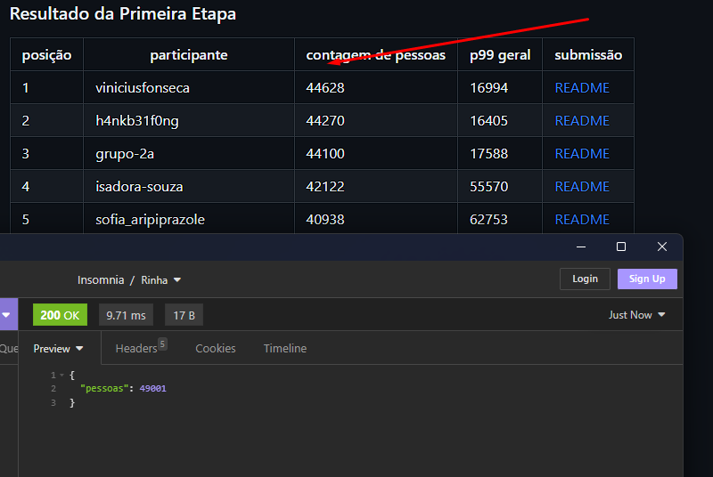
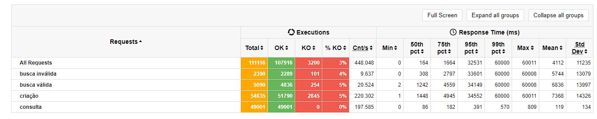

# 🐔 BACKEND RINHA (FIGHT) 2023 Q3™ in Typescript 🐔

An implementation made in my beloved [Typescript](https://www.typescriptlang.org/).    

It's a pretty basic implementation done in a few hours, but it works.  
<small>At least on my machine...</small>

After [RINHA](https://github.com/zanfranceschi/rinha-de-backend-2023-q3), I kept seeing comments, the node was very far from the top, 8th place in languages, but what does it matter? it's not the language but the programmer I decided to give it a try.

This project was made using [Fastify](https://www.fastify.io/) (Web Service Framework) and [Prisma](https://www.prisma.io/) (ORM), and [ PostgreSQL](https://www.postgresql.org/) (Relational Database) and [Redis](https://redis.io/) (In Memory Cache Database) and [Docker](https://www.docker.com/) (Container manager).

You can check the challenge here [Instructions](https://github.com/zanfranceschi/rinha-de-backend-2023-q3/blob/main/INSTRUCOES.md).

Before we continue, I want to warn you that this project was developed specifically for the challenge, it is not a production project, it was not made to be scalable, it was not made to be safe, it was not made to be beautiful, it was made to show the power of [Node](https://nodejs.org/en).

In the end I managed to surpass the first classified with his application made in [Rust](https://www.rust-lang.org/), but it's worth remembering that I only made the code after the challenge was over, so I don't want to take the merit of the first place, but to show that [Node](https://nodejs.org/en) is a very powerful and that it can be used for many things.

To test the program, [Gatling](https://gatling.io/) was used, which is an open source load testing tool, and is also the sponsor of the event, so I leave the results obtained below.

# 🔗 Redes Sociais

- Github: [`@Pedromdsn`](https://github.com/Pedromdsn)
- Twitter/x: [`@PPedromdsn`](https://twitter.com/PPedromdsn)
- Website: [`pedromdsn.site`](https://pedromdsn.site)
